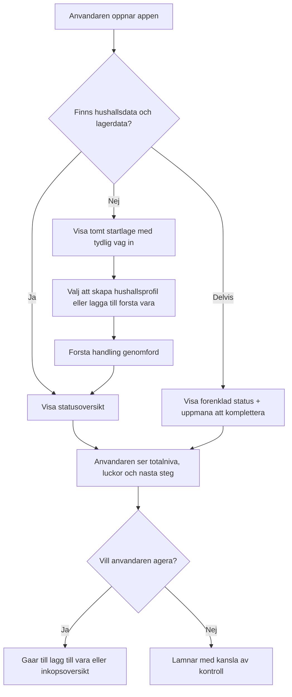
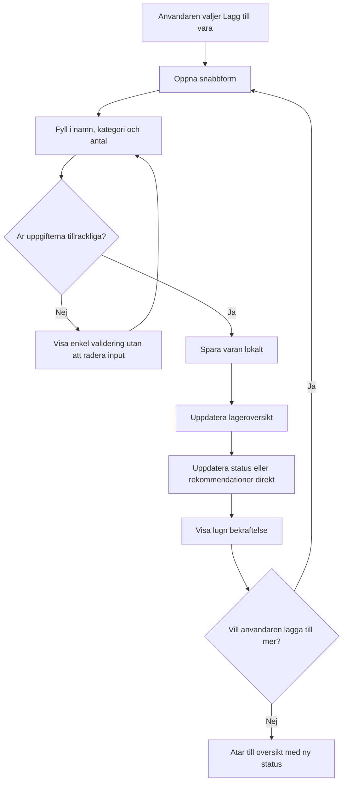
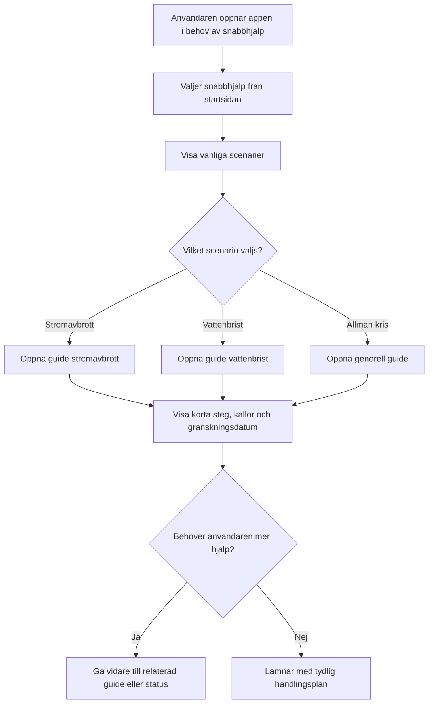

---
stepsCompleted:
  - 1
  - 2
  - 3
  - 4
  - 5
  - 6
  - 7
  - 8
  - 9
  - 10
  - 11
  - 12
  - 13
  - 14
lastStep: 14
inputDocuments:
  - "_bmad-output/planning-artifacts/prd.md"
  - "_bmad-output/project-context.md"
  - "out-001-ai-delivery-handoff.md"
  - "docs/BePreparedUX.jpg"
---

# UX Design Specification BePrepared

**Author:** Filijoxen
**Date:** 2026-04-08

---

<!-- UX design content will be appended sequentially through collaborative workflow steps -->

## Executive Summary

### Project Vision

BePrepared ar en mobil-forst krisapp som hjalper privatpersoner att bygga och uppratthalla hushallsberedskap genom att kombinera behovsberakning, lageroversikt, gap-analys och snabb tillgang till praktiska guider. UX-malet ar att skapa en upplevelse som kanns lugn, tydlig och handlingsinriktad aven under stress eller vid begransad uppkoppling.

### Target Users

Den primara anvandaren ar hushallsansvarig som vill forsta hushallets beredskapsbehov, registrera sitt hemmaforrad och fa konkreta nasta steg for att forbattra beredskapen. En sekundar anvandare ar hushallsmedlemmen som snabbt behover kunna oppna appen for att lasa guider eller se hushallets status utan att ga igenom komplexa floden. Pa systemsidan finns aven en intern innehallsredaktor som sakerstaller att guider ar sakliga, kallmarkta och uppdaterade.

### Key Design Challenges

Den forsta utmaningen ar att balansera tva olika anvandningslagen: vardaglig planering och akut snabbhjalp. Den andra ar att visualisera status, brister och rekommendationer pa ett satt som skapar handlingskraft utan alarmism. Den tredje ar att sakerstalla att karnupplevelsen fungerar mobil-forst, offline och med mycket lag anvandningsfriktion.

### Design Opportunities

Det finns en stark mojlighet att skapa en ovanligt tydlig startupplevelse med tva primara ingangar: hushallets beredskap och snabb hjalp vid kris. Det finns ocksa mojlighet att differentiera produkten genom en lugn och trovardig tonalitet i status och guider, dar kallor och granskningsstatus ar synliga utan att tynga granssnittet. Slutligen finns en tydlig UX-fordel i att gora offline-stod och lokal tillforlitlighet till en integrerad del av upplevelsen i stallet for en teknisk detalj i bakgrunden.

## Core User Experience

### Defining Experience

Karnupplevelsen i BePrepared kretsar kring att anvandaren snabbt ska kunna oppna appen och forsta hushallets aktuella beredskapsstatus. Produkten ska ge en direkt kansla av orientering: hur ligger vi till, vad saknas och vad bor vi gora harnast. Den sekundara men avgorande stodinteraktionen ar att kunna uppdatera forradet utan friktion, sa att statusbilden kanns levande och palitlig over tid.

### Platform Strategy

BePrepared ska vara webb forst men mobiloptimerad. Upplevelsen ska darfor designas for sma skarmar, touchinteraktion och korta sessioner, samtidigt som losningen fortfarande fungerar val i vanlig weblasare pa storre skarmar. Plattformen ska stodja offlinekritiska delar av upplevelsen och kunna utvecklas mot PWA-beteende dar det starker tillganglighet och robusthet.

### Effortless Interactions

Den viktigaste friktionsfria interaktionen ar att kunna lagga till en vara pa nagra sekunder. Anvandaren ska ocksa utan anstrangning kunna oppna appen och direkt forsta hushallets status utan att tolka komplex data eller navigera flera nivaer. Att hitta nasta steg, se vad som saknas och na ratt del av appen ska kannas omedelbart och sjalvforklarande.

### Critical Success Moments

Det viktigaste framgangsogonblicket intraffar nar anvandaren oppnar appen och direkt kanner att hushallet har koll. Ett annat kritiskt ogonblick ar nar anvandaren snabbt kan lagga till en vara och omedelbart se att status eller oversikt uppdateras. Om appen misslyckas med att ge tydlig status eller gor lageruppdatering langsam eller osaker, riskerar hela upplevelsen att kannas mindre trovardig.

### Experience Principles

- Status fore detaljer: anvandaren ska forst forsta laget, sedan kunna fordjupa sig.
- Snabb uppdatering bygger fortroende: att lagga till eller justera forrad maste vara extremt enkelt.
- Mobil tydlighet forst: alla karnfloden ska fungera naturligt pa liten skarm och med touch.
- Omedelbar trygghet: appen ska skapa kanslan av kontroll och handlingskraft direkt vid oppning.

## Desired Emotional Response

### Primary Emotional Goals

Den primara emotionella malsattningen for BePrepared ar att anvandaren ska kanna kontroll och trygghet. Appen ska inte forstarka oro, utan hjalpa anvandaren att uppleva att situationen ar begriplig och hanterbar. Upplevelsen ska signalera att hushallet kan ta steg framat, aven om beredskapen an inte ar komplett.

### Emotional Journey Mapping

Nar anvandaren forst oppnar appen ska kanslan vara lugn orientering: det ar tydligt var man borjar och vad appen hjalper till med. Under karnupplevelsen, sarskilt vid statuskontroll och lageruppdatering, ska anvandaren kanna enkelhet och framatrorrelse snarare an osakerhet. Efter en lyckad handling ska kanslan vara att hushallet nu ar battre forberett an tidigare. Nar anvandaren atervander till appen ska upplevelsen kannas konsekvent, stabil och palitlig. Om nagot gar fel ska anvandaren fortfarande kanna att systemet ar lugnt, tydligt och aterhamtningsbart.

### Micro-Emotions

De viktigaste mikroemotionerna for BePrepared ar fortroende, tydlighet, lattnad och kanslan av att vara pa ratt vag. Anvandaren ska kanna sig vagledd snarare an bedomd, och informerad snarare an overvaldigad. Forvirring ar den viktigaste negativa mikroemotionen att undvika, eftersom den snabbt underminerar bade tillit och handlingskraft i den har typen av produkt.

### Design Implications

Om anvandaren ska kanna kontroll och trygghet maste granssnittet vara tydligt, forutsagbart och fritt fran onodig komplexitet. Statusvyer ska sammanfatta laget snabbt och med lugnt sprak. Floden for att lagga till eller uppdatera lager ska ge tydlig bekräftelse och omedelbar aterkoppling sa att anvandaren kanner framsteg. Felhantering maste vara mjuk, tydlig och losningsfokuserad, med fokus pa hur anvandaren gar vidare snarare an vad som gick fel. Visuell och spraklig design ska undvika alarmism, skuld och domedagskansla.

### Emotional Design Principles

- Designa for kontroll: anvandaren ska snabbt forsta laget och kanna att nasta steg ar tydligt.
- Designa for trygghet: tonalitet, aterkoppling och struktur ska minska oro och skapa stabilitet.
- Designa bort forvirring: varje karnvy ska vara latt att tolka utan extra forklaring.
- Designa for aterhamtning: nar nagot gar fel ska anvandaren tydligt kunna forsta vad som hant och hur hen gar vidare.
- Designa for progress: varje lyckad handling ska kannas som ett konkret steg mot battre beredskap.

## UX Pattern Analysis & Inspiration

### Inspiring Products Analysis

Tva tydliga inspirationskallor for BePrepared ar Sortly och My Pantry Tracker. Sortly ar relevant som referens for hur inventarie- och oversiktsdata kan presenteras pa ett tydligt, strukturerat och lattbegripligt satt utan att anvandaren kanner sig overvaldigad. Den typen av UX stodjer BePrepareds behov av snabb statusforstaelse och enkel lagerhantering.

My Pantry Tracker ar relevant som inspiration for en mer vardagsnara, lagtrosklig upplevelse dar anvandaren snabbt kan registrera och folja innehall utan att systemet kanns tungt eller administrativt. Det ligger nara BePrepareds behov av att gora lageruppdatering snabb, sjalvklar och tillganglig aven for anvandare som inte vill lagga mycket tid pa appen.

Det som gor bada referenserna anvandbara ar inte att de loser exakt samma problem som BePrepared, utan att de visar hur inventarie- och hushallsrelaterad information kan goras latt att forsta, latt att uppdatera och tillrackligt tydlig for att skapa fortroende.

### Transferable UX Patterns

Flera UX-monster fran dessa inspirationskallor ar overforbara till BePrepared. Ett viktigt navigationsmonster ar att prioritera snabb overblick fore djup funktionalitet, sa att anvandaren direkt ser det viktigaste forst. Ett annat ar att halla informationshierarkin enkel och tydligt sektionerad, sa att lager, status och nasta steg inte blandas ihop.

Pa interaktionsniva ar snabb registrering ett centralt monster att ta med. Att kunna lagga till eller uppdatera en vara utan manga steg stodjer BePrepareds karnupplevelse starkt. Ett annat overforbart monster ar omedelbar aterkoppling efter en andring, sa att anvandaren direkt ser att informationen har sparats och paverkat helhetsbilden.

Visuellt ar enkelhet, tydlig gruppering och lag visuell belastning de mest relevanta monstern att ta med vidare. For BePrepared ar detta sarskilt viktigt eftersom anvandaren ska kunna forsta laget snabbt, aven under stress eller med begransat fokus.

### Anti-Patterns to Avoid

BePrepared bor undvika dashboard-tunga granssnitt med manga samtidiga paneler, statusblock och konkurrerande prioriteringar, eftersom det riskerar att skapa forvirring i stallet for kontroll. Appen bor ocksa undvika att gora lagerhantering for formulartung eller detaljerad i tidiga steg, eftersom det skulle hoja troskeln for regelbunden anvandning.

En annan anti-pattern ar att presentera beredskapsinformation pa ett alarmistiskt eller skuldbelaggande satt. Om status, brister eller rekommendationer kanns domande eller overvaldigande minskar appens kansla av trygghet. Slutligen bor appen undvika att gomma viktiga handlingar bakom flera nivaer av navigation, sarskilt for snabbhjalp och statuskontroll.

### Design Inspiration Strategy

Det vi bor adoptera ar snabb input, enkel struktur, tydlig gruppering och omedelbar aterkoppling, eftersom dessa monster stodjer BePrepareds karnupplevelse: att snabbt forsta hushallets status och enkelt halla informationen uppdaterad. Vi bor ocksa adoptera en lagtrosklig interaktionsmodell dar anvandaren snabbt far bekräftelse och kanner framsteg.

Det vi bor anpassa ar inventarie- och pantrymonstren till en krisappskontext. I BePrepared racker det inte med att visa vad som finns hemma; UX:en maste ocksa forklara hur det relaterar till beredskapsniva, trygghet och nasta steg. Darfor behover inspirationsmonstren kompletteras med lugn statuskommunikation, prioriterade brister och snabb tillgang till guider.

Det vi bor undvika ar administrativ tyngd, enterprise-liknande layoutmonster och all visuell eller spraklig dramatik som skapar oro. BePrepared ska inspireras av enkelheten i vardagsverktyg, men oversatta den till en upplevelse som kanns trygg, handlingsinriktad och robust i en kriskontext.

## Design System Foundation

### 1.1 Design System Choice

BePrepared ska bygga pa ett themeable designsystem med Tailwind som grund och manga fardiga komponenter tillgangliga direkt. Malet ar att fa hog utvecklingshastighet utan att ge upp mojligheten att skapa ett eget, lugnt och tydligt uttryck for krisappen.

### Rationale for Selection

Det har valet passar projektets behov val eftersom hastighet ar prioriterat, samtidigt som appen behover en mer forfinad och trygg kansla an vad ett tungt standardbibliotek normalt ger. Tailwind ligger redan i projektkontexten och ger en bra teknisk grund for att bygga snabbt. Genom att kombinera Tailwind med ett fardigt komponentlager kan teamet fa tillgang till manga anvandbara byggblock direkt, utan att behova skapa hela UI-grunden fran noll.

Den onskade visuella riktningen ar ren, lugn och Apple-inspirerad snarare an enterprise-tung. Darfor ar ett flexibelt Tailwind-baserat system mer lampligt an till exempel Material Design eller Ant Design, som riskerar att fora produkten narmare ett generiskt verktygs- eller adminuttryck.

### Implementation Approach

Implementationen bor utga fran Tailwind som styling- och token-grund, med ett fardigt komponentlager for vanliga byggblock som knappar, formularfalt, kort, listor, dialoger, navigation och feedback-komponenter. Dessa komponenter ska sedan sattas samman till produktanpassade monster for status, snabbhjalp, lagerregistrering och beredskapsoversikt.

Komponenterna ska valjas och anvandas med mobil-forst-princip, tydlig touchinteraktion och stod for lag visuell belastning. Fokus ska ligga pa snabb leverans, konsekvens och tillgangliga standardmonster snarare an att uppfinna nya komponentbeteenden i onodan.

### Customization Strategy

Systemet ska tematiseras for att skapa ett lugnt, fortroendeingivande och enkelt uttryck. Anpassningen bor fokusera pa farg, typografi, spacing, hornradier, ikonografi och tonalitet snarare an pa att bygga om varje komponent. Visuellt bor uttrycket rora sig mot en ren, mjuk och aterhallsam riktning inspirerad av Apple-lik enkelhet, men anpassad till BePrepareds behov av tydlig status, trygghet och handlingskraft.

Anpassningen ska ocksa sakerstalla att komponenterna stodjer appens emotionella mal: kontroll, trygghet, tydlighet och aterhamtning. Det innebar att bekräftelser, felmeddelanden, statusmarkeringar och navigationsmonster maste kannas lugna, konsekventa och latta att forsta aven under stress.

## 2. Core User Experience

### 2.1 Defining Experience

Den definierande upplevelsen i BePrepared ar att anvandaren oppnar appen och snabbt far en tydlig overblick over hushallets beredskapslage, samtidigt som appen visar vad som saknas och hur laget kan forbattras. Karnan ar att gora beredskap konkret, begriplig och handlingsbar. Upplevelsen ska kannas enkel och vagledande, sa att anvandaren inte bara ser status utan ocksa forstar vad nasta steg ar.

### 2.2 User Mental Model

Manga anvandare loser idag problemet mentalt, genom att forsoka halla reda pa beredskapen i huvudet och genom en ungefarlig kansla for vad som finns i skap och forrad. Deras mentala modell ar darfor inte systematisk eller exakt, utan bygger pa uppskattning och minne. BePrepared behover mota detta genom att inte kannas som ett komplext administrationsverktyg, utan som ett enkelt stod som hjalper anvandaren att omvandla nagot diffust till nagot tydligt och anvandbart.

### 2.3 Success Criteria

Karnupplevelsen ar lyckad nar anvandaren direkt forstar hushallets status utan att behova tolka komplicerad information. Den kanns sarskilt lyckad nar anvandaren lagger till en vara och omedelbart ser att status, oversikt eller rekommendationer uppdateras. Det ska kannas som att systemet reagerar direkt och att anvandarens handling har effekt.

Tydliga framgangsindikatorer ar:
- anvandaren forstar snabbt hur hushallet ligger till
- anvandaren ser direkt effekt nar nagot uppdateras
- anvandaren kanner sig mer forberedd efter interaktionen an fore

### 2.4 Novel UX Patterns

BePrepared bor i huvudsak bygga pa etablerade UX-monster som anvandarna redan kanner igen, sasom tydliga statuskort, enkla listor, snabbregistrering och direkt aterkoppling. Innovationen ligger inte i att introducera ett nytt interaktionssatt, utan i att kombinera valkanda monster pa ett satt som gor beredskap ovanligt latt att forsta och folja upp.

Produktens unika varde kommer darfor fran hur dessa etablerade monster satts samman: statusoverblick, inventarieuppdatering, vagledning och nasta steg i ett sammanhallet flode.

### 2.5 Experience Mechanics

**Initiation:**  
Anvandaren oppnar appen och mots direkt av hushallets aktuella beredskapsstatus eller en tydlig vag in till den.

**Interaction:**  
Anvandaren granskar statusoversikten, ser vad som saknas och kan snabbt lagga till eller uppdatera en vara med minimalt antal steg.

**Feedback:**  
Systemet ger omedelbar och tydlig aterkoppling nar nagot andras. Status, oversikt eller rekommendationer uppdateras direkt sa att anvandaren ser effekten av sin handling.

**Completion:**  
Anvandaren kanner att hushallets lage ar tydligare an innan och att appen har hjalpt till att flytta beredskapen framat. Nasta steg ska vara synligt och enkelt att ta vidare direkt fran den avslutade interaktionen.

## Visual Design Foundation

### Color System

BePrepared ska anvanda en kall och lugn fargpalett med blagra, dimgron och mjuka neutrala toner som grund. Fargsystemet ska stodja kanslorna kontroll, trygghet och tydlighet snarare an dramatik eller alarmism. Primara ytor bor vara ljusa och lugna, med morkare text och diskreta accentfarger for interaktion och status.

Semantiska farger ska anvandas aterhallsamt och med tydlig funktion. Grona, gula och roda signaler kan anvandas for status och avvikelser, men i dampade och sofistikerade toner snarare an starka varningsfarger. Fargpaletten ska hjalpa anvandaren att orientera sig snabbt utan att skapa stress.

### Typography System

Typografin ska vara modern och neutral, med hog lasbarhet pa bade sma och stora skarmar. Hierarkin ska vara tydlig men inte aggressiv, sa att anvandaren snabbt kan skanna status, sektioner och nasta steg. Typsnitt och typografisk skala bor stodja ett lugnt och rationellt intryck, med fokus pa enkel forstaelse snarare an stark visuell personlighet.

Systemet ska ha tydliga nivaer for rubriker, underrubriker, brodtext, etiketter och statusinformation. Text som ror status, guider och aterkoppling ska prioriteras for snabb lasning och god tillganglighet.

### Spacing & Layout Foundation

Layouten ska vara balanserad: tillrackligt luftig for att kannas lugn och tydlig, men tillrackligt kompakt for att ge anvandaren meningsfull overblick utan overdriven scroll eller fragmentering. Informationsytor ska grupperas tydligt i sektioner som stodjer snabb orientering, sarskilt pa mobil.

Spacing-systemet bor bygga pa en konsekvent rytm som gor att komponenter kanns sammanhangande och forutsagbara. Layouten ska stodja mobil-forst anvandning, tydlig skanning, enkla touchmal och sekventiell forstaelse av status, lager och nasta steg.

### Accessibility Considerations

Den visuella grunden maste sakerstalla god kontrast mellan text och bakgrund, tydlig lasbarhet i alla centrala statusvyer och tillrackligt stora touchytor for mobil anvandning. Semantiska farger far inte bara information ensamma, utan ska alltid kompletteras med text, ikoner eller struktur. Typografi, spacing och komponentkontrast ska utformas sa att anvandaren snabbt kan forsta innehall aven under stress, lag koncentration eller daliga ljusforhallanden.

## Design Direction Decision

### Design Directions Explored

Sex designriktningar utforskades for BePrepared, med variationer i informationshierarki, visuell tyngd, navigationslogik och balans mellan status, vagledning och lagerhantering. Riktningarna spann fran mer statuscentrerade och vagledande upplagg till mer inventarienara och visuellt designade alternativ.

Utforskningen visade att flera riktningar stodde projektets mal om kontroll, trygghet och tydlighet, men att vissa var starkare for snabb statusforstaelse medan andra var starkare for snabb och vardagsnara lageruppdatering.

### Chosen Direction

Vald riktning ar **Direction 3: Soft Ledger**.

Denna riktning bygger pa en mjuk, tydlig och lattillganglig inventarieupplevelse dar anvandaren snabbt kan se vad som finns hemma, uppdatera lagret med lag friktion och direkt forsta hur forandringar paverkar hushallets beredskapslage. Riktningen ligger nara de inspirationskallor som identifierats tidigare, sarskilt Sortly och My Pantry Tracker, men anpassas for att stodja BePrepareds statuslogik och kansla av trygg vagledning.

### Design Rationale

Direction 3 valdes eftersom den bast stodjer projektets behov av enkelhet, snabb registrering och tydlig vardagsanvandning. Den gor det latt for anvandaren att forsta och uppdatera sitt forrad utan att upplevelsen kanns tung eller teknisk. Samtidigt skapar den en bra grund for att koppla lagerdata till beredskapsstatus och nasta steg.

Riktningen passar ocksa val med produktens definierande interaktion: att snabbt fa overblick och kanna att hushallet ar battre forberett. Den stodjer etablerade UX-monster som anvandarna redan forstar, vilket minskar inlarningstroskeln och okar kanslan av att appen bara fungerar.

### Implementation Approach

Implementationen bor utga fran ett inventarie- och listdrivet startskarmssprak, dar anvandaren snabbt kan se kategorier, senaste uppdateringar och tydliga mojligheter att lagga till eller justera varor. Statuskopplingen ska vara narvarande i hela upplevelsen, sa att anvandaren inte bara ser vad som finns i lagret utan ocksa vad det betyder for hushallets beredskap.

For att undvika att losningen blir ett vanligt lagersystem behover riktningen kompletteras med tydlig statusoversattning, lugn aterkoppling och synliga nasta steg. Komponenterna bor darfor anvandas sa att snabb input och omedelbar respons kombineras med enkel beredskapsforklaring och lag visuell belastning.

## User Journey Flows

### Kolla beredskapsstatus

Det har flodet beskriver hur anvandaren snabbt far en begriplig bild av hushallets nulage och vad som bor prioriteras harnast. Flodet maste vara snabbt att forsta, ge lag kognitiv belastning och tydligt visa nasta steg utan att anvandaren behover tolka mycket data.

### Lagg till vara i forradet

Det har flodet beskriver den viktigaste aterkommande vardagsinteraktionen. Det maste kannas snabbt, sjalvklart och belonande. Anvandaren ska direkt se att handlingen har paverkat helhetsbilden.

### Oppna snabbhjalp eller guide

Det har flodet beskriver det akuta laget dar anvandaren snabbt behover ratt information. Flodet maste fungera aven utan full setup och med mycket lag friktion.

### Journey Patterns

Flera gemensamma monster aterkommer i alla tre floden. For det forsta behover anvandaren alltid kunna forsta laget snabbt utan att lasa langa texter eller tolka komplexa datavyer. For det andra ska varje central handling ge omedelbar och lugn aterkoppling. For det tredje maste floden kunna starta fran tydliga entry points pa startsidan utan att anvandaren forst behover forsta hela appens struktur.

Gemensamma monster som bor standardiseras:
- status forst, detaljer vid behov
- snabb vag till handling fran varje central vy
- enkel validering och mjuk felhantering
- direkt aterkoppling efter uppdateringar
- tydliga nasta steg efter varje avslutat flode

### Flow Optimization Principles

Flodena ska optimeras for att minimera steg till varde och minska kognitiv belastning. Statusflodet ska ge begriplig overblick pa nagra sekunder. Lagerflodet ska gora input sa kort och enkel som mojligt. Guideflodet ska ge anvandaren ratt hjalp inom hogst nagra interaktioner.

Optimeringsprinciper:
- visa bara den information som behovs for nasta beslut
- lat anvandaren kanna framsteg direkt efter varje handling
- anvand etablerade monster i stallet for nya interaktionsmodeller
- bygg in aterhamtning utan dramatik nar nagot saknas eller gar fel
- hall snabbhjalp tillganglig oavsett hur komplett hushallsprofilen ar

## Component Strategy

### Design System Components

BePrepared ska i forsta hand bygga vidare pa komponenter som redan finns tillgangliga via det valda Tailwind-baserade designsystemet och dess komponentlager. Dessa foundation-komponenter bor tacka vanliga UI-behov som knappar, formularfalt, select-komponenter, kort, listor, dialoger, drawers, badges, navigationselement och feedback-komponenter som alerts, toasts och tomlagen.

Dessa komponenter ger en snabb grund for implementation och bor anvandas konsekvent for att skapa ett sammanhallet uttryck genom hela appen. De ska tematiseras enligt den visuella grunden, men inte byggas om i onodan om standardbeteenden redan stodjer anvandarbehoven.

### Custom Components

#### PreparednessStatusCard

**Purpose:** Visa hushallets samlade beredskapslage pa ett snabbt och begripligt satt.  
**Usage:** Anvands pa startsida och i statusoversikt som primar sammanfattning.  
**Anatomy:** Rubrik, statusniva, kort forklaring, eventuellt procent- eller nivaindikator, prioriterat nasta steg.  
**States:** Standard, partiell data, lag beredskap, forbattrad status efter uppdatering.  
**Accessibility:** Ska kunna tolkas utan farg ensam och fungera val for skarmlasare.

#### GapSummaryCard

**Purpose:** Sammanfatta vad som saknas i hushallets beredskap.  
**Usage:** Visas i anslutning till status och inkopsoversikt.  
**Anatomy:** Kategori, gapbeskrivning, prioritet, eventuell rekommenderad atgard.  
**States:** Enskilt gap, flera gap, inga gap, osaker data.  
**Accessibility:** Prioritet maste framga genom text och struktur, inte bara farg.

#### QuickAddItemSheet

**Purpose:** Gora det mojligt att lagga till en vara med minimal friktion.  
**Usage:** Oppnas fran startsida, lageroversikt eller snabbatgard.  
**Anatomy:** Falt for namn, kategori och antal, valfri metadata, spara/avbryt.  
**States:** Tom, ifylld, valideringsfel, sparar, sparad.  
**Accessibility:** Tydlig fokusordning, etiketter, felmeddelanden och touchvanlig utformning.

#### InventoryCategoryGroup

**Purpose:** Presentera lagerartiklar grupperade i begripliga kategorier.  
**Usage:** I lageroversikt och eventuellt i statusrelaterade vyer.  
**Anatomy:** Kategorirubrik, artikelrader, sammanfattning, eventuell tomvy.  
**States:** Kollapsad, expanderad, tom kategori, kategori med varningar.  
**Accessibility:** Tydlig rubrikstruktur och stod for tangentbordsnavigering dar relevant.

#### NextStepPrompt

**Purpose:** Visa det mest relevanta nasta steget for anvandaren.  
**Usage:** Pa startsida, i statuskort och efter avslutade handlingar.  
**Anatomy:** Kort rekommendation, motivering, primar handling.  
**States:** Standard, hog prioritet, informationslage, efter genomford atgard.  
**Accessibility:** Ska vara tydlig aven vid skarmlasning och inte bero pa ikon eller farg ensam.

#### GuideScenarioCard

**Purpose:** Ge en tydlig ingang till snabbhjalp for ett scenario.  
**Usage:** Pa startsida, snabbhjalpsvy och guideindex.  
**Anatomy:** Scenarionamn, kort beskrivning, ikon eller markor, action for att oppna guide.  
**States:** Standard, senast oppnad, offline tillganglig, uppdaterad guide.  
**Accessibility:** Kortet ska vara latt att aktivera med touch och tydligt beskrivet semantiskt.

#### PreparednessDeltaFeedback

**Purpose:** Visa att en nylig forandring faktiskt forbattrade eller paverkade beredskapen.  
**Usage:** Efter att anvandaren lagt till, redigerat eller tagit bort en vara.  
**Anatomy:** Kort aterkoppling, vad som forandrades, eventuell ny status eller effekt.  
**States:** Positiv forbattring, neutral uppdatering, negativ paverkan, osaker effekt.  
**Accessibility:** Budskapet ska vara begripligt i text aven utan animation eller farg.

#### OfflineStateBanner

**Purpose:** Kommunicera offline-lage lugnt och tydligt utan att skapa stress.  
**Usage:** I app-shell eller overst i relevanta vyer nar nat saknas.  
**Anatomy:** Kort statusmeddelande, eventuell information om vad som fortfarande fungerar.  
**States:** Offline, ateransluten, begransad synk, aterstallningslage.  
**Accessibility:** Ska inte blockera innehall i onodan och ska fungera val med skarmlasare.

### Component Implementation Strategy

Strategin ska vara att anvanda design system-komponenter som grund och endast skapa egna komponenter dar BePrepared har ett tydligt domanbehov som inte loses val av generiska byggblock. Alla egna komponenter ska byggas med samma visuella tokens, spacingregler och interaktionsmonster som resten av systemet sa att upplevelsen kanns sammanhallen.

De egna komponenterna ska i forsta hand stodja tre saker: snabb statusforstaelse, snabb lageruppdatering och snabb vag till ratt guide. Komponenter som visar status, gap och nasta steg maste prioriteras hogt eftersom de bar produktens karnvarde. Samtidigt ska komponenterna byggas sa att de gar att ateranvanda i flera vyer utan att skapa parallella UI-monster.

### Implementation Roadmap

**Phase 1 - Core Components**
- PreparednessStatusCard
- QuickAddItemSheet
- InventoryCategoryGroup
- GuideScenarioCard

**Phase 2 - Supporting Components**
- GapSummaryCard
- NextStepPrompt
- OfflineStateBanner

**Phase 3 - Enhancement Components**
- PreparednessDeltaFeedback

Den har ordningen stodjer MVP-logiken val: forst status, lager och snabbhjalp, sedan fortydligande och tillforlitlighet, och darefter mer forfinad aterkoppling.

## UX Consistency Patterns

### Button Hierarchy

Primara knappar ska anvandas for den mest rekommenderade nasta handlingen i varje vy, till exempel `Lagg till vara`, `Visa status` eller `Oppna guide`. Sekundara knappar anvands for alternativa vagar eller mindre kritiska handlingar, som att avbryta, ga tillbaka eller visa mer information. Tertiara handlingar bor i forsta hand presenteras som textlankar eller lagmalda inline-actions.

Primara actions ska vara fa, tydliga och lugna i tonalitet. Varje skarm bor ha en tydlig huvudhandling, inte flera visuellt konkurrerande CTA:er. Pa mobil ska knappar vara tillrackligt stora for trygg touchinteraktion och placeras dar de ar latta att na.

**Monsterregler:**
- en primar handling per huvudsektion
- sekundara handlingar ska visuellt backa undan
- destruktiva handlingar ska krava tydlig bekräftelse
- knapptexter ska vara handlingsorienterade och konkreta

### Feedback Patterns

All aterkoppling i BePrepared ska kannas lugn, tydlig och handlingsinriktad. Vid lyckade handlingar ska appen bekräfta vad som hant och garna ocksa vad det betyder, till exempel att en vara lagts till och att hushallets status forbattrats eller uppdaterats. Vid fel ska appen forklara problemet pa ett enkelt satt och visa hur anvandaren gar vidare.

Feedback ska aldrig kannas dramatisk eller skuldbelaggande. Warning- och error-lagen ska vara tydliga men aterhallsamma. Offline-lage ska kommuniceras som ett driftlage, inte som ett misslyckande.

**Monsterregler:**
- bekräfta alltid lyckade karnhandlingar
- koppla garna feedback till faktisk effekt nar det ar mojligt
- felmeddelanden ska vara losningsfokuserade
- statusmeddelanden ska kunna forstas utan farg ensam

### Form Patterns

Formular i BePrepared ska vara korta, enkla och fokuserade pa nasta nodvandiga uppgift. I karnfloden som `Lagg till vara` ska endast den information som verkligen behovs visas forst, medan extra metadata halls valfri eller sekundar. Validering ska ske tydligt men mjukt, utan att radera anvandarens input.

Formmonster ska prioritera snabb inmatning pa mobil, tydliga etiketter, forutsagbara falt och enkla val dar det gar. Systemet ska hjalpa anvandaren att kanna att formularet gar snabbt att slutfora, inte att det ar ett administrativt moment.

**Monsterregler:**
- borja med minsta mojliga antal obligatoriska falt
- visa fel nara ratt falt
- anvand tydliga etiketter, inte bara placeholders
- lat anvandaren spara snabbt utan onodiga steg

### Navigation Patterns

Navigationen ska bygga pa enkel orientering mellan tre centrala omraden: status, forrad och snabbhjalp. Startsidan ska fungera som tydlig ingang till dessa huvudlagen. Viktiga handlingar ska nas utan djupa navigationskedjor, sarskilt snabbhjalp och statusoversikt.

Pa mobil bor navigationen vara latt att forsta direkt, med ett litet antal tydliga toppnivaval. Floden som uppstar i kontext, exempelvis att lagga till vara eller oppna en guide, ska kannas som naturliga nasta steg fran den vy dar behovet uppstar.

**Monsterregler:**
- hall toppnivan liten och tydlig
- lat startsidan bara de viktigaste entry points
- minimera hopp mellan informationslagen
- gor nasta steg synligt direkt i varje central vy

### Additional Patterns

#### Empty States

Tomlagen ska alltid vara vagledande. Om anvandaren annu inte har lagt in nagra varor eller inte skapat hushallsprofil ska appen inte kannas tom eller dod, utan tydligt visa vad som ar forsta vettiga steget.

#### Loading States

Laddning ska kommuniceras lugnt och utan blockerande kansla. Dar lokal data redan finns ska appen visa den direkt och undvika att ersatta fungerande vyer med fullskarmsladdning.

#### Offline States

Offline-lage ska presenteras tydligt men odramatiskt. Appen ska forklara vad som fortfarande fungerar och halla karninnehall tillgangligt. Offlineindikatorer ska vara synliga men inte dominera granssnittet.

#### Search and Filtering

Om sok eller filtrering anvands i lagerdelen ska de vara enkla, begripliga och sekundara till grundoverblicken. Filter far inte bli sa manga att de gor inventariedelen tung eller teknisk.

### Custom Pattern Rules

- Status ska alltid vara lattare att forsta an radata.
- Anvandaren ska alltid se nasta steg efter en viktig handling.
- Appen ska hellre forklara an signalera med stark visuell dramatik.
- Mobil forst galler for alla monsterbeslut.
- Bekraftelse, validering och offlineinformation ska uttryckas konsekvent i hela systemet.

## Responsive Design & Accessibility

### Responsive Strategy

BePrepared ska utformas mobil forst, med sarskilt fokus pa snabb orientering, tydliga touchytor och lag kognitiv belastning pa sma skarmar. Mobilversionen ska bara karnupplevelsen fullt ut och fungera som primar referens for informationshierarki och interaktionsmonster.

Pa storre skarmar ska upplevelsen inte introducera nya funktioner, utan ge anvandaren mer overblick samtidigt. Desktop- och storre tabletlayouter ska darfor framst anvanda extra yta for att visa fler relevanta informationsblock parallellt, sasom status, luckor, senaste uppdateringar och nasta steg.

### Breakpoint Strategy

BePrepared ska anvanda en mobil-forst breakpointstrategi med tydliga skiften mellan mobil, tablet och desktop.

Foreslagna breakpoints:
- Mobil: `320px - 767px`
- Tablet: `768px - 1023px`
- Desktop: `1024px+`

Layoutforandringar ska vara progressiva och fokusera pa att skala upp overblick snarare an att byta interaktionslogik. Mobilen definierar grundflodet, medan tablet och desktop tillats visa fler sektioner samtidigt nar det forbattrar forstaelsen.

### Accessibility Strategy

BePrepared ska utformas enligt `WCAG AA`. Det innebar att tillganglighet inte ska behandlas som ett tillagg, utan som en integrerad del av produktens grundkvalitet. Detta ar sarskilt viktigt eftersom appen ska fungera i situationer dar anvandaren kan vara stressad, trott, distraherad eller ha begransad koncentration.

Strategin ska sarskilt sakerstalla:
- god kontrast mellan text och bakgrund
- tydliga fokusmarkeringar
- tangentbordsnavigering dar relevant
- skarmlasarstod for centrala floden
- semantisk struktur i status, formular och guider
- touchytor pa minst `44x44px`
- att farg aldrig ar enda barare av viktig information

### Testing Strategy

Responsivitet och tillganglighet ska verifieras bade automatiskt och manuellt.

**Responsiv testning:**
- test pa riktiga mobilskarmar och vanliga desktopstorlekar
- test i aktuella moderna weblasare
- verifiering av informationshierarki i mobil, tablet och desktop
- test av touchmal, scrollbeteende och innehallsdensitet

**Tillganglighetstestning:**
- automatiserade accessibility-kontroller
- test av tangentbordsnavigering
- test med skarmlasare for centrala floden
- kontroll av kontraster och semantisk struktur
- kontroll att feedback, status och felmeddelanden forstas utan farg ensam

### Implementation Guidelines

Utvecklingen ska folja mobil-forst-princip med relativa matt och progressiva layoutanpassningar. Navigation pa mobil ska i forsta hand bygga pa bottom navigation for centrala omraden som status, forrad och guider. Pa desktop ska fler informationsytor kunna visas parallellt, men utan att skapa ett tatpackat eller administrativt uttryck.

Utvecklingsteamet ska anvanda semantisk HTML, tydliga ARIA-attribut dar det behovs, konsekvent fokuslogik och komponenter som redan fran borjan stodjer tillganglig interaktion. Statuskort, formular, feedback och offlineinformation ska byggas sa att de fungerar lika tydligt for anvandare med hjalpmedel som for anvandare utan hjalpmedel.
